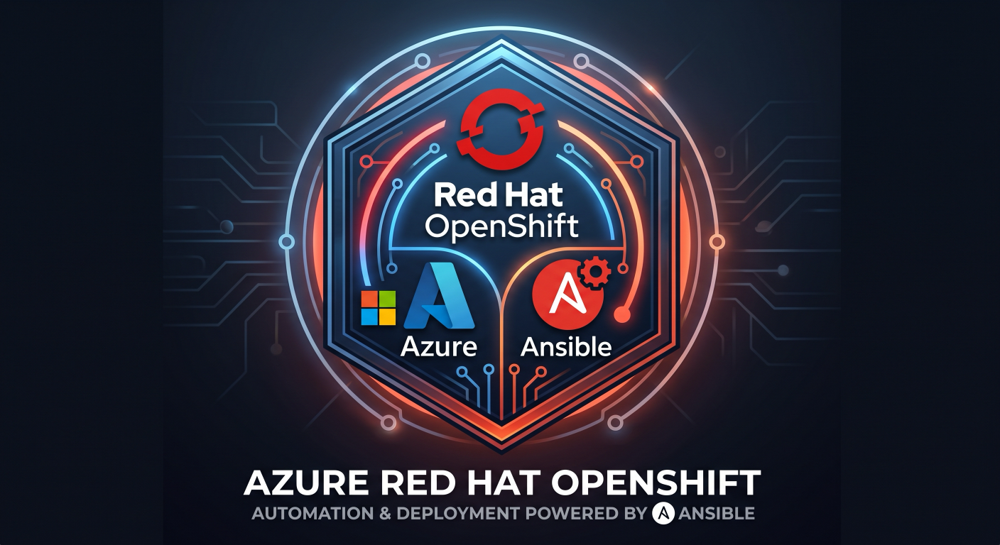

# Azure Red Hat OpenShift (ARO) Deployment

<p align="center">
  
</p>

## Overview

Azure Red Hat OpenShift (ARO) provides highly available, fully managed OpenShift clusters on demand, monitored and operated jointly by Microsoft and Red Hat. Kubernetes is at the core of Red Hat OpenShift.

This repository contains Ansible automation to deploy ARO in either of its two architectures:

| `aro_architecture` | What you get | Status |
|--------------------|--------------|--------|
| `classic` (default) | ARO standard architecture — control plane VMs run in your subscription | GA |
| `hcp` | ARO with **hosted control planes** — control plane runs in a Microsoft-managed subscription operated by Red Hat SREs; you pay only for worker nodes | Public preview |

## Features

- **Two architectures, one playbook** - switch with `-e aro_architecture=hcp`
- **Pre-flight checks** - resource provider registration and regional vCPU quota are verified before anything is created
- **Idempotent execution** - re-runs converge instead of failing or duplicating work
- **Secrets stay out of the console** - credentials are written to `0600` files and a ready-to-use kubeconfig
- **Clean teardown** - `aro_delete.yml` handles both architectures and can run unattended

## Prerequisites

- **Azure CLI** - [Installation instructions](https://learn.microsoft.com/cli/azure/install-azure-cli) (HCP requires 2.67.0 or later)
- **Azure permissions** - Owner, or Contributor + User Access Administrator (HCP creates role assignments)
- **Ansible** with the `azure.azcollection` collection
  ```bash
  ansible-galaxy collection install azure.azcollection
  pip install -r ~/.ansible/collections/ansible_collections/azure/azcollection/requirements.txt
  ```
- **OpenShift CLI tools** - [Latest `oc` & `kubectl` binaries](https://mirror.openshift.com/pub/openshift-v4/clients/ocp/latest/)
- **Red Hat pull secret** (classic only) - from [console.redhat.com](https://console.redhat.com/openshift/install/pull-secret)

The ARO HCP CLI extension is installed automatically on first HCP run.

## Getting Started

1. Clone this repository
   ```bash
   git clone https://github.com/ryannix123/aro_ansible.git
   cd aro_ansible
   ```

2. **Classic only:** download your pull secret from [console.redhat.com](https://console.redhat.com/openshift/install/pull-secret) and save it as `vars/pull-secret.txt`. It's listed in `.gitignore`, so it won't be committed.

3. Review `vars/aro_vars.yml`

4. Authenticate to Azure
   ```bash
   az login
   ```

5. Run the playbook
   ```bash
   # Classic (standard architecture)
   ansible-playbook aro_deployment.yaml

   # Hosted control planes (preview) - must be an HCP preview region
   ansible-playbook aro_deployment.yaml -e aro_architecture=hcp -e location=eastus2 \
     -e hcp_cluster_version=4.20 -e hcp_nodepool_version=4.20.8
   ```
   For HCP, leave the versions unset on the first run and the playbook prints what's available in your region.

6. Access your cluster
   ```bash
   export KUBECONFIG=$PWD/vars/kubeconfig-<cluster_name>
   oc whoami
   ```
   Connection details are in `vars/aro-cluster-info-<cluster_name>.txt`.

## Hosted control planes notes

- **Regions (preview):** australiaeast, brazilsouth, canadacentral, centralindia, eastus2, switzerlandnorth, uksouth, westeurope
- **Everything is one ARM deployment:** `templates/aro_hcp.bicep` creates the VNet (worker subnet + delegated VNet integration subnet), NSG, 13 managed identities, role assignments, a Key Vault with an etcd KMS key, the cluster and a node pool. Typical time: 15-20 minutes.
- **Immutable choices:** API visibility, ingress visibility, FIPS, and image registry can't be changed after creation.
- **Access:** there is no kubeadmin and no built-in OAuth server. The playbook requests a break-glass admin kubeconfig valid for 24 hours. Configure an [external OIDC provider](https://learn.microsoft.com/azure/openshift/howto-configure-external-authentication) for ongoing access.
- **Lock down the API:** set `hcp_api_authorized_cidrs: ["<your-ip>/32"]`.
- **Re-runs:** if the cluster already exists, the ARM deployment is skipped (re-deploying would rotate the etcd key version). Override with `-e hcp_force_redeploy=true`.

## Configuration Options

Key settings in `vars/aro_vars.yml` (see the file for the full list):

| Parameter | Description | Default |
|-----------|-------------|---------|
| `aro_architecture` | `classic` or `hcp` | classic |
| `location` | Azure region | centralus |
| `resource_group` | Resource group name | aro |
| `cluster_name` | Cluster name | aro-cluster |
| `enforce_quota_check` | Fail if regional vCPU quota is short | true |
| `domain` | Custom domain (classic, optional) | openshifthelp.com |
| `aro_version` | Pin an OpenShift version (classic, optional) | latest |
| `master_vm_size` / `worker_vm_size` | Classic VM sizes | Standard_D8s_v3 / Standard_D4s_v3 |
| `worker_count` | Classic worker count | 3 |
| `hcp_cluster_version` / `hcp_nodepool_version` | HCP versions (minor / patch) | required |
| `hcp_node_vm_size` / `hcp_node_count` | HCP node pool | Standard_D8s_v3 / 2 |
| `hcp_api_visibility` / `hcp_ingress_visibility` | Public or Private | Public |
| `hcp_api_authorized_cidrs` | CIDRs allowed to reach the API | [] (open) |
| `hcp_fips` | FIPS-validated crypto on workers | false |

### Custom domain (classic)

If you set `domain`, create these DNS records after deployment. The playbook prints the IPs:

```
api.<domain>     A  <API IP>
*.apps.<domain>  A  <Ingress IP>
```

## Deleting a cluster

```bash
ansible-playbook aro_delete.yml                              # interactive
ansible-playbook aro_delete.yml -e aro_architecture=hcp
ansible-playbook aro_delete.yml -e auto_approve=true -e delete_resource_group=true   # CI / AAP
```

For HCP, the Key Vault is purged after the resource group is deleted so the next deployment can reuse its name.

## Troubleshooting

- **Quota exceeded**: request more quota in the Azure portal, or set `enforce_quota_check: false` to warn only. Also check the per-family quota: `az vm list-usage -l <region> -o table`
- **HCP region error**: use one of the preview regions above
- **HCP deployment failed**: the playbook prints the failing ARM operations; also see `az deployment operation group list -g <rg> -n aro-hcp-<cluster>`
- **Authentication failures**: run `az login` and `az account show`

See the [ARO troubleshooting guide](https://learn.microsoft.com/azure/openshift/troubleshoot).

## Documentation and Resources

- [ARO documentation](https://learn.microsoft.com/azure/openshift/)
- [Compare standard and hosted control planes architectures](https://learn.microsoft.com/azure/openshift/concepts-classic-hosted-control-planes-comparison)
- [Create an ARO HCP cluster](https://learn.microsoft.com/azure/openshift/howto-create-custom-hosted-cluster)
- [OpenShift Container Platform documentation](https://docs.redhat.com/en/documentation/openshift_container_platform/)
- [Red Hat ARO product page](https://www.redhat.com/en/technologies/cloud-computing/openshift/azure)

## Video Tutorial

A step-by-step video tutorial is available here:

<p align="center">
  <a href="https://youtu.be/d701iQ2v2J0">
    
  </a>
</p>

## Contributing

Contributions are welcome! Please feel free to submit a Pull Request.

## License

This project is licensed under the GNU General Public License v3.0 - see the LICENSE file for details.
